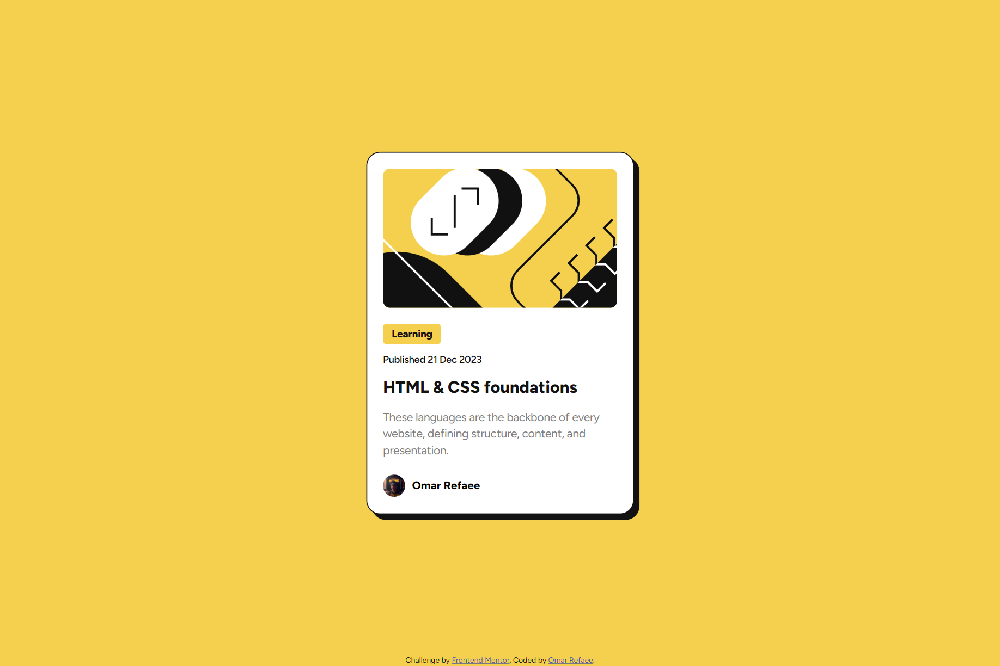

# Frontend Mentor - Blog preview card solution

This is a solution to the [Blog preview card challenge on Frontend Mentor](https://www.frontendmentor.io/challenges/blog-preview-card-ckPaj01IcS).

## Table of contents

-   [Overview](#overview)
    -   [The challenge](#the-challenge)
    -   [Screenshot](#screenshot)
    -   [Links](#links)
-   [My process](#my-process)
    -   [Built with](#built-with)
-   [Author](#author)

## Overview

### The challenge

Users should be able to:

-   See hover and focus states for all interactive elements on the page

### Screenshot

### Links

-   Solution URL: [Solution URL](https://www.frontendmentor.io/solutions/blog-preview-card-html-scss-aipoJexmek)
-   Live Site URL: [Live Site URL](https://blog-preview-card-or.netlify.app/)

## My process

### Built with

-   HTML5
-   CSS3
-   Flexbox
-   [SCSS](https://sass-lang.com/) - CSS Preprocessor

## Author

-   Website - [Omar Refaee](https://github.com/OmarRefaee)
-   Frontend Mentor - [@OmarRefaee](https://www.frontendmentor.io/profile/OmarRefaee)
-   Facebook - [@OmarRefaee0](https://www.Facebook.com/OmarRefaee0)
